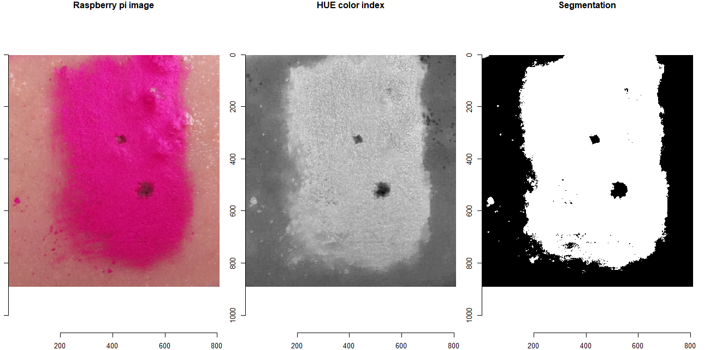
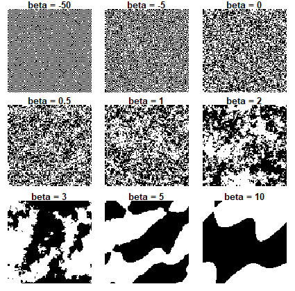

## 1/f Noise Herbivory Project at CSU

This repo hosts code for simulations and data analysis for an INTERN funded project, examining the consequences of spatial autocorrelation in fine scale plant toxin distribution. 

Real time herbivory detection on agar diet by raspberry pi camera footage with processing powered by [`herbivar`](https://github.com/vsbpan/herbivar). 

Example spectra of binary toxin dose arrangements with different levels of autocorrelation. Generated using 1/f spectral synthesis method.

