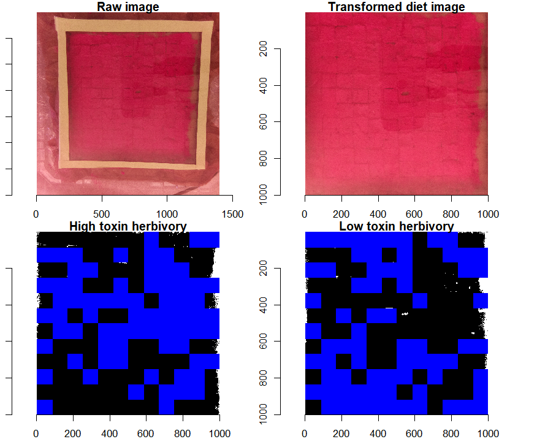
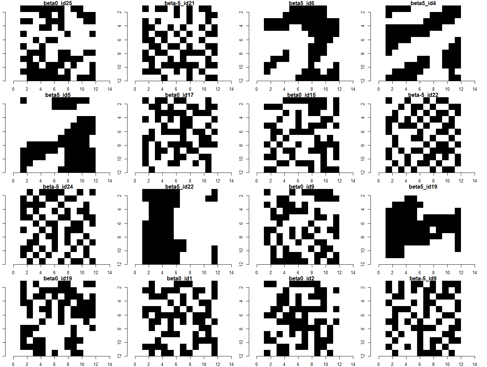

# 1/f Noise Herbivory Project at CSU

This repo hosts code for simulations and data analysis for an INTERN funded project, examining the consequences of spatial autocorrelation in fine scale plant toxin distribution. 

Automatic herbivory detection by raspberry pi camera footage with processing powered by [`herbivar`](https://github.com/vsbpan/herbivar). A layer of luster dust was painted on the surface of an agar block to aid herbivory detection. Perspective and shadow correction were applied before herbivory detection. The resulting image is then matched to treatment spectra to determine which location of the diet had what toxin concentration. 

Example binary toxin dose arrangements with different levels of autocorrelation. Generated using 1/f spectral synthesis method.

