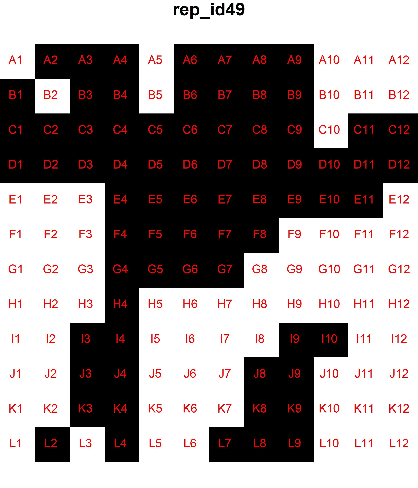

# 1/f Noise Project

## Overview

This repo hosts code for image processing and data analysis for an INTERN funded project, examining the consequences of spatial autocorrelation and variance in fine scale plant toxin distribution on caterpillar outcomes. 

Summary of the data processing pipeline that derives measures of herbivore movement and feeding behavior that may explain differential herbivore performance. Lighter squares represent diet tiles that contain a higher concentration of xanthotoxins. A layer of red luster dust was sprayed on top of the diet to delineate eaten and uneaten diet. 

## Installation

Run `Package_installation.R` to install repository dependencies. For the dependency *herbivar*, see  [herbivar](https://github.com/vsbpan/herbivar) GitHub page on installation instructions. 

## Description

### Code library 

The custom code written for this project are bundled as a pseudo simulated package *spat1f*. It can be imported using `source(spat1f/init.R)`, or `soure(spat1f/init_analysis.R)` to get the cleaned experimental metadata in the global environment as well.  

* `spat1f/` is the root directory of the *spat1f* package. `.R` files in this directory are not loaded in the package. 
    * `spat1f/R/` contains the R source code. 
    * `spat1f/src/` contains the C++ source code.
    * `DESCRIPTION` package description file
    * `NAMESPACE` name space file

* Key objects
    * `cimg`: RGB image tensor array from *imager* that represents an image in R. Can be used with functions from *imager* and some functions in *spat1f*.
    * `pixset`: binary image tensor array from *imager* that represents binary masks in R. Can be used with functions from *imager* and some functions in *spat1f*. 
    * `imlist`: a list of `cimg` or `pixset` objects. 
    * `data_dict`: various Mask-R-CNN outputs and metadata for a collection of images. Has functions for importing, conversion to `COCO_Json` and `events`, data extraction, summary, subsetting, merging, visualization, evaluation, and validation. 
    * `COCO_Json`: a list of data.frames and lists that represents a COCO annotation file. Has functions for importing, exporting, merging, randomization, subsetting, and summary. 
    * `issf_fit`: fitted integrated step selection function. Has functions for summary and step simulation.
    * `events`: not an actual class, but used throughout. A data.frame of location and associated metadata of each caterpillar at each time point. Has functions for validation, data extraction, summary, and visualization.
    * `amt_distr` no S3 generics, but used throughout. A list of parameter values and metadata for a parametric distribution. Has functions for updating, density, random number generation, and fitting. 

### File structure

* `annotations/` houses `.json` files of image annotations in COCO format. This is mostly used for back up purposes. 

* `archive/` houses misc scripts that are no longer in use or is there only as a backup. 

* `cleaned_data/` houses results of expensive computations. 
    * `cleaned_data/events/` houses `.csv` files on the location and associated metadata at each time point for each caterpillar. Called by `fetch_events()`. Named after each trial ID. 
    * `cleaned_data/data_dicts/` houses `data_dict` class objects that represents a cleaned and formatted version of the Mask-R-CNN output of each frame. `data_dict` objects are at the center of all data analyses and are supported by various S3 methods. The `.rds` files are called by `fetch_data_dict()`. Named after each trial ID. 
    * `consumption_mask_derivative.csv` results from end of experiment herbivory masks. 
    * `event_derivative.csv` results from movement tracks and ISSF fits. 
    * `SEM_sim*.csv` simulation results from `SEM_pred_coef()` for each bootstrap refit of the data. Basically the results of total effects through certain paths or after removing certain nodes. 
    * `sus_frames_list.rds` a list of frames for each rep for which they are flagged as having false head movements. 

* `data_processing/` houses various scripts used to complete certain computer vision / data processing goals. 
    * `crop_raw_image_auto.R` Read saved anchors and for those images that have yet to be cropped, crop them. 
    * `data_dict_to_COCO.R` Write `data_dict` objects as `.json` files in COCO format. Compatible with *COCO annotator* and *detectron2*.  
    * `detect_herbivory.R` Compute binary mask and associated summary statistics of herbivory from processed images. 
    * `flag_inference_errors.R` Flag potential errors in Mask-R-CNN predictions.  
    * `generate_spec.R` Generate treatment spectra and save them on the computer for later reference.  
    * `image_overlay_vid.R` Overlay treatment spectra or Mask-R-CNN predictions on processed image stack and stitch together as a video using *FFmpeg*. 
    * `inference_processing.R` Turn raw inference from *detectron2* into `data_dict` objects and events. 
    * `time_lapse_crop.R` Launches the anchor picker app, saves anchors, and crop selected sets of raw images. 
    * `time_lapse_export.R` Code for exporting and renaming image files from USB drive containing raw image files from raspberry pi. 
    * `SEM_simulation.R` Bootstrap refit of SEM and subsequent calculation of the total effects of selected paths. 

* `demo/` houses images for populating this README file. 

* `graphs` houses graphs generated for this project. Due to the folder size, it is not uploaded to GitHub. 

* `misc_tests/` houses prototype images used to develop the image processing capabilities of this repository. Now defunct. 

* `notes/` houses notes on the rationale and details on some of the analysis / processing done. 

* `processed_feed/` houses subdirectories named after the trial ID (e.g. `rep50`) containing the output of cropped time lapse images. The naming convention is as such: `processed_repID_camID_sTimeInSeconds_rankN.jpg` e.g. `processed_rep3_cam3_s4325_rank13.jpg`. This directory is not uploaded to GitHub due to its size. 

* `raw_data/` houses raw data and some intermediary data products. 
    * `raw_data/inferences/` houses `.csv` outputs from Mask R-CNN predictions generated in python. Named after each trial ID.  
    * `raw_data/picked_anchors/` houses lists of lists of anchors picked from the shiny app (`anchor_picker_app()`) used for perspective correction and cropping of the raw time lapse images. Named after each trial ID. 
    * `raw_data/spectra_mta/`houses treatment spectra metadata in `.csv` format generated from `data_processing/generate_spec.R`
    * `sample1_modelv6_validation_inference.csv` Mask-R-CNN inference on test dataset along with ground truths. 
    * `1_f_noise_experiment data_DATE.csv` Experimental metadata, including herbivore performance outcomes saved at different dates. The file with the latest date is the one used in all analyses. 

* `time_lapse_feed/` houses subdirectories named after the trial ID (e.g. `rep50`) containing raw time lapse images. The naming convention is as such: `repID_camID_sTimeInSeconds.jpg` e.g. `rep3_cam3_s4325.jpg`. This directory is not uploaded to GitHub due to its size. 

* `video/` houses videos generated by *FFmpeg* that stitches together the time lapse image stack. This directory is not uploaded to GitHub due to its size. 

* `invisible/` houses various intermediary data products too large to be uploaded to GitHub. 

* `manuscript_plots.R` code for generating some plots in manuscript 1.

* `prediction_evaluator.R` code for evaluating the performance of Mask-R-CNN

### Data

* `raw_data/1_f_noise_experiment data_Jan_31_2024.csv` Final experimental data (some of the variables were not analyzed in manuscript 1)
    * **rep_id**: caterpillar ID / replication ID
    * **beta**: the spectral exponent used to generate the treatment spectrum
    * **syn_id**: the treatment spectrum ID that maps to `raw_data/trt_spectra_meta/master_trt_meta.csv`
    * **cam_id**: camera ID
    * **arena_id**: arena ID
    * **mean_trt**: mean xanthotoxin dose in the diet 
    * **var_trt**: variation treatment
    * **low_diet**: xanthotoxin dose in the low dose diet
    * **high_diet**: xanthotoxin dose in the high dose diet
    * **assemble_date**: diet landscape assembly date in mm-dd-YYYY
    * **date_start**: date of experiment start (when the caterpillar is placed on treatment diet) in mm-dd-YYYY
    * **time_start**: time of experiment start in HH:MM
    * **cat_pre_wt**: caterpillar pre-experimental weight in grams
    * **date_end_camera**: date when the experiment ended in mm-dd-YYYY. 
    * **time_end_camera**: time when the experiment ended in HH:MM. 
    * **cat_post_wt**: caterpillar weight at the time when the experiment ended. 
    * **cat_dead_cam_end**: 1 (TRUE) or 0 (FALSE) the caterpillar died within five days. 
    * **pupation_date**: date when caterpillar begun to spin for eventual pupation in mm-dd-YYYY
    * **pupal_weight**: the weight of the melanized pupa in grams
    * **pupated_cam_end**: 1 (TRUE) or 0 (FALSE) the caterpillar begun to spin within five days.
    * **eclosure_date**: date when the moth emerged from the pupa in mm-dd-YYYY
    * **sex**: male or female moth
    * **death_date**: date when the caterpillar died in mm-dd-YYYY
    * **deformed_adult**: 1 (TRUE) or 0 (FALSE) whether the adult had deformed wings or body
    * **notes**: misc notes
    * **temperature**: temperature of the room at which the experiment was done in Celsius. 
    * **session_id**: experimental session ID
    * **error**: 1 (TRUE) or 0 (FALSE) a fatal error occurred for the replication that warrants its removal from analyses. Reason written for when TRUE. 
    * **premature_camera_end**: whether the camera stopped taking pictures before the end of the experiment. 
    * **camera_cutoff**: the time (seconds) limit after which the time lapse photos are no longer relevant (e.g. because the caterpillar died).

* `raw_data/trt_spectra_meta/master_trt_meta.csv` treatment spectra metadata
    * **syn_id**	the treatment spectrum ID
    * **syn_date** system time when the spectrum was generated
    * **spec_A1 -- spec_L12** whether the spectrum should have a high (1) or low (0) xanthotoxin diet at the corresponding coordinate. 

